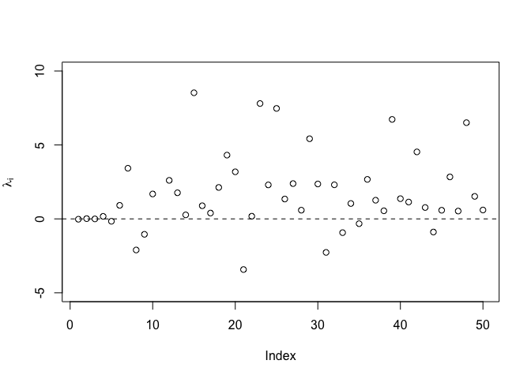

20221011_random_effect_m1
================
Yurun (Ellen) Ying
2022-10-11

``` r
dat <- read.csv(here("data/raw/loss_aversion.csv"))
dat_clean <- data.frame(la = dat[,"la"], se = dat[, "se_imp"])
```

Now we have a dataset
^m_{i=1}").
In the first benchmark model, we model each

as a normal distribution with unknown mean

and known variance
.

")

The unknown means are normally distributed with unknown mean

and unknown variance
:

")

Now we would like to assign priors to the above model

``` r
set.seed(4238)
N <- 50
lambda_0 <- rlnorm(n = N)
sigma <- rexp(1, n = N)
lambda_bar <- rnorm(mean = lambda_0, sd = sigma, n = N)
lambda_i <- rnorm(mean = lambda_bar, sd = dat_clean[,"se"], n = N)

plot(lambda_i, ylim = c(-5,10), xlab = NULL, ylab = expression(lambda[i]))
abline(h = 0, lty = 2)
```

<!-- -->

Thus we have the model:

 \\
\overline{\lambda}_i \mid \lambda_0, \sigma &\sim \text{Normal}(\lambda_0, \sigma^2) \\
\lambda_0 &\sim \text{Log-Normal}(0, 1) \\
\sigma &\sim \text{Exp}(1)
\end{aligned}")

Let’s inspect it

``` r
m1.1 <- readRDS(here("data/processed/random_effect_m1.1.RData"))
set.seed(4835)
post_1.1 <- extract.samples(m1.1)

# plot the posterior distribution of lambda_bar over the observed values of lambda
plot_1.1_post <- data.frame(post_lambda_bar = as.vector(post_1.1$lambda_bar)) %>% 
ggplot(aes(x = post_lambda_bar)) +
  # use geom_density with specific geom type to show lines in the legend
  # note the name of the color and linetype corresponds to the ones in the manual settings
  stat_density(size = 1.5, aes(color = "Estimated", linetype = "Estimated"),
               geom = "line", show.legend = TRUE) +
  stat_density(data = dat_clean, 
               aes(x = la, color = "Reported", linetype = "Reported"), 
               size = 1.5, geom = "line", 
               inherit.aes = FALSE, show.legend = TRUE) +
  geom_vline(xintercept = 1, linetype = 2) +
  scale_x_continuous(limits = c(0, 6), expand = c(0, 0),
                     breaks = seq(0, 6, by = 1), labels = seq(0, 6, by = 1)) +
  scale_y_continuous(expand = expansion(mult = c(0, 0), add = c(0, 0.05))) +
  scale_color_manual(name = NULL, 
                     breaks = c("Estimated","Reported"),  
                     values = c("Estimated" = "steelblue", 
                                "Reported" = "black"),
                     guide = guide_legend(keywidth = 3)) + 
  scale_linetype_manual(name = NULL, 
                     breaks = c("Estimated","Reported"),  
                     values = c("Estimated" = 1, "Reported" = 2),
                     guide = guide_legend(keywidth = 3)) +
  labs(x = expression(paste("Loss aversion coefficient (",lambda,")")),
       y = "Density") +
  theme_classic() +
  theme(legend.position = c(0.85, 0.9))

#ggsave("figures/m1_post_lambda_bar.pdf", width = 8, height = 5)
include_graphics(here("figures/m1_post_lambda_bar.pdf"))
```

<!-- -->
